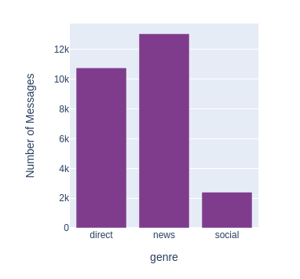

# Disaster Response Pipeline Project

### Project:
This project is part of Udacity's 
[Data Science Nanodegree](https://www.udacity.com/course/data-scientist-nanodegree--nd025)
Goal of the project is to build a ML pipeline to classify emergency messages into one or several categories 
such as `water`, `food` or `shelter`.

### Dataset
The data to work on was provided by [Figure Eight](https://www.figure-eight.com/), 
containing a `messages` and a `categories` dataset. After merging these two, the 
dataset looks like this:  

Each message is assigned one or more categories out of 36 possible categories. 
Additionally, each message is assigned a genre (`direct`, `news` or `social`), 
which however is not part of the feature set intended to use for message 
classification. The following visualizations provide an overview of the nature of the dataset.

### Project folder
This project folder includes a Jupyter Notebook, where some preliminary explorations 
are done, as well as Python files for the ETL and ML pipelines, and for the 
Web App building on these. The individual steps performed in each file are shown in the figures below.

#### Exploration and Preparation: disaster-response-pipeline-preparation.ipynb
Exploration and visualization of the data is performed, and different classifier 
configurations are compared:  

* `RandomForestClassifier` with default parameters
* `RandomForestClassifier` with optimized parameters using `GridSearchCV`
*  `RandomForestClassifier` with the configuration that turned out to be the 
best in the previous step, and the additional features `SpecialCharacterUsageCounter` 
and `FirstPersonUsageCounter`. 
The idea is that a high proportion of certain characters (such as `#` and `@`) and 
usage of grammatical first person might indicate to genre `social`, 
and this might indirectly improve the classification of category, since the 
categories are distributed unevenly over the genres.
* `LinearSVC` with default parameters
* `MultinomialNB` with default parameters

Future work to further improve the performance of message classification might 
include:

* Investigating how to handle the messages without any category  
* Finding more relevant features
* Appling other `GridSearchCV` to the `LinearSVC` and `MultinomialNB` as well 
* Using Deep Learning for this classification task

#### ETL Pipeline: process-data.py
This python script performs the following steps:

* Loads the `messages` and `categories` datasets
* Merges the two datasets
* Cleans the data
* Stores it in a SQLite database

#### ML Pipeline: train-classifier.py
This Python script builds a machine learning pipeline that:

* Loads data from the SQLite database
* Splits the dataset into training and test sets
* Builds a text processing and machine learning pipeline
* Trains and tunes a model using GridSearchCV
* Outputs results on the test set
* Exports the final model as a pickle file

#### Flask Web App: run.py
The Web App displays visualizations of dataset and offers the possibility to 
interactively enter a sample message, which will then be classified.

### Instructions:
1. Run the following commands in the project's root directory to set up your database and model.

    - To run ETL pipeline that cleans data and stores in database
        `python data/process_data.py data/disaster_messages.csv data/disaster_categories.csv data/DisasterResponse.db`
    - To run ML pipeline that trains classifier and saves
        `python models/train_classifier.py data/DisasterResponse.db models/classifier.pkl`

2. Run the following command in the app's directory to run your web app.
    `python run.py`

3. Go to http://0.0.0.0:3001/
